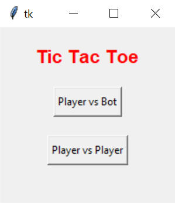

# Python - GUI Calculator

## Sections 
- [Description](#description)
- [Getting Started](#getting-started)
    - [Dependencies](#dependencies)
    - [Installing](#installing)
    - [Executing](#executing)
- [Author](#author)
- [License](#license)

---
## Description
This program is a simple Tic Tac Toe game made using the Tkinter Python toolkit. 
There are two game modes which are included, Player vs Bot, and Player vs Player. 

**Player vs Bot:**
Go against the computer, which randomly choses a box to place their O inside. The goal is to get three X's in a row before the computer gets three O's in a row. 

**Player vs Player:**
Play with yourself or your friends where Player 1 is X and Player 2 is O. The goal is to get three X's in a row before the opponent gets three O's in a row. 

The title screen below is the screen which appears when the program is first run. <br />


Below is the gamboard which is displayed when a gamemode is selected. You can click the buttons to place your X or O. <br />


The winner screen shown below is displayed when either player wins or draws. <br /> 


---
## Getting Started

### Dependencies
- Python 3.6.0+
- Mac/Windows OS

<br />

### Installing 
```bash
$ git clone https://github.com/JugalBili/Python-GUI-TicTacToe
```
Or you can download the zip directly from github. 

<br />

### Executing
To execute to program, open the zip file into an IDE of your choice, or use the following in the termial: 
```bash
python TicTacToe.py
```
> **Make Sure** to run the command inside the folder

---
## Author 
**Jugal Bilimoria**
<br />August 11th 2020

<br />Project was made as a method for me to fully understand the basic concepts of Python and Tkinter.

---
## License 


MIT License

Copyright (c) 2020 Jugal Bilimoria

Permission is hereby granted, free of charge, to any person obtaining a copy
of this software and associated documentation files (the "Software"), to deal
in the Software without restriction, including without limitation the rights
to use, copy, modify, merge, publish, distribute, sublicense, and/or sell
copies of the Software, and to permit persons to whom the Software is
furnished to do so, subject to the following conditions:

The above copyright notice and this permission notice shall be included in all
copies or substantial portions of the Software.

THE SOFTWARE IS PROVIDED "AS IS", WITHOUT WARRANTY OF ANY KIND, EXPRESS OR
IMPLIED, INCLUDING BUT NOT LIMITED TO THE WARRANTIES OF MERCHANTABILITY,
FITNESS FOR A PARTICULAR PURPOSE AND NONINFRINGEMENT. IN NO EVENT SHALL THE
AUTHORS OR COPYRIGHT HOLDERS BE LIABLE FOR ANY CLAIM, DAMAGES OR OTHER
LIABILITY, WHETHER IN AN ACTION OF CONTRACT, TORT OR OTHERWISE, ARISING FROM,
OUT OF OR IN CONNECTION WITH THE SOFTWARE OR THE USE OR OTHER DEALINGS IN THE
SOFTWARE.